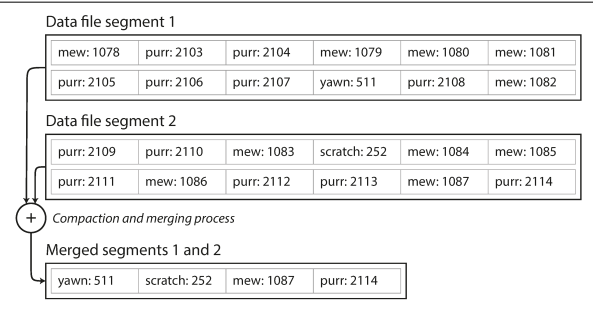
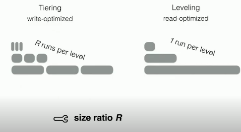
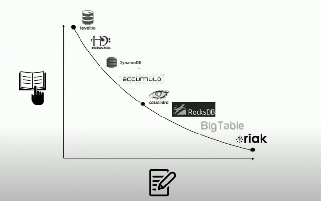
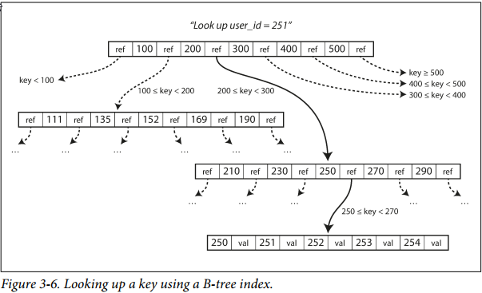

# 3. Storage and retrieval

Databases need to do two things: store the data and give the data back to you.

## Data structures that power up your database

Many databases use a _log_, which is append-only data file. Real databases have more issues to deal with tho (concurrency control, reclaiming disk space so the log doesn't grow forever and handling errors and partially written records).

> A _log_ is an append-only sequence of records

In order to efficiently find the value for a particular key, we need a different data structure: an _index_. An index is an _additional_ structure that is derived from the primary data.

Well-chosen indexes speed up read queries, but every index slows down writes.

### Hash Indexes

The simplest possible indexing strategy is this: keep an in-memory hash map where every key is mapped to a byte offset in the data file—the location at which the value can be found. Whenever you append a new key-value pair to the file, you also update the hash map to reflect the offset of the data you just wrote (this works both for inserting new keys and for updating existing keys). When you want to look up a value, use the hash map to find the offset in the data file, seek to that location, and read the value.

So we only ever append to a file - how do we avoid eventually running out of disk space?

A good solution is to break the log into segments of a certain size by closing a segment file when it reaches a certain size, and making subsequent writes to a new segment file. We can then perform compaction on these segments, while merging segments simultaneously, as illustrated in Figure 3-3.

After the merging process is complete, we switch read requests to use the new merged segment instead of the old segments, and the old segment files can simply be deleted.

Each segment now has its own in-memory hash table, mapping keys to file offsets. In order to find a value for a key, we first check the most recent segment hash map; if the key is not present we check the second-most recent segment and so on. The merging process keeps the number of segments small, so lookups don't need to check many hash maps.

Some issues that are important in a real implementation:

* File format. It is simpler to use binary format.
* Deleting records. Append special deletion record to the data file (_tombstone_) that tells the merging process to discard previous values.
* Crash recovery. If restarted, the in-memory hash maps are lost. You can recover from reading each segment but that would take long time. Bitcask speeds up recovery by storing a snapshot of each segment hash map on disk.
* Partially written records. The database may crash at any time. Bitcask includes checksums allowing corrupted parts of the log to be detected and ignored.
* Concurrency control. As writes are appended to the log in a strictly sequential order, a common implementation is to have a single writer thread. Segments are immutable, so they can be read concurrently by multiple threads.

Append-only design turns out to be good for several reasons:

* Appending and segment merging are sequential write operations, much faster than random writes, especially on magnetic spinning-disks.
* Concurrency and crash recovery are much simpler.
* Merging old segments avoids files getting fragmented over time.

Hash table has its limitations too:

* The hash table must fit in memory. It is difficult to make an on-disk hash map perform well.
* Range queries are not efficient.

### SSTables and LSM-Trees

We introduce a new requirement to segment files: we require that the sequence of key-value pairs is _sorted by key_.

We call this _Sorted String Table_, or _SSTable_. We require that each key only appears once within each merged segment file (compaction already ensures that). SSTables have few big advantages over log segments with hash indexes

1. **Merging segments is simple and efficient** (we can use algorithms like _mergesort_). When multiple segments contain the same key, we can keep the value from the most recent segment and discard the values in older segments.
2. **You no longer need to keep an index of all the keys in memory.** For a key like `handiwork`, when you know the offsets for the keys `handback` and `handsome`, you know `handiwork` must appear between those two. You can jump to the offset for `handback` and scan from there until you find `handiwork`, if not, the key is not present. You still need an in-memory index to tell you the offsets for some of the keys. One key for every few kilobytes of segment file is sufficient.
3. Since read requests need to scan over several key-value pairs in the requested range anyway, **it is possible to group those records into a block and compress it** before writing it to disk. This saves disk space and reduces I/O bandwidth use.

#### Constructing and maintaining SSTables

How do we get the data sorted in the first place? With red-black trees or AVL trees, you can insert keys in any order and read them back in sorted order.

* When a write comes in, add it to an in-memory balanced tree structure (_memtable_).
* When the memtable gets bigger than some threshold (~ few megabytes), write it out to disk as an _SSTable_ file. Writes can continue to a new memtable instance.
* On a read request, try to find the key in the memtable, then in the most recent on-disk segment, then in the next-older segment, etc.
* From time to time, run merging and compaction in the background to discard overwritten and deleted values.

If the database crashes, the most recent writes are lost. We can keep a separate log on disk to which every write is immediately appended. That log is not in sorted order, but that doesn't matter, because its only purpose is to restore the memtable after crash. Every time the memtable is written out to an SSTable, the log can be discarded.

#### Making an LSM-tree out of SSTables

The algorithm described here is essentialy what is used in LevelDB and RocksDB (backs Facebook MySQL), key-value storage engine libraries. Similar storage engines are used in Cassandra and Hbase both of which were inspired by Google's Bigtable (which introduced SSTable and memtable)

Log Structure Merge-Trees
:   Storage engines that are based on this principle of merging and compacting sorted files. LSM-tree enables fast writes by buffering incoming data in memory and flushing it as independent sorted batches to storage whenever the buffer is full. To enable fast reads, LSM-tree sort-merges batches in storage to restrict the number that reads have to search, and it also uses in-memory Bloom filters to enable point reads to probabilistically skip accessing batches that do not contain a target entry.

LSM-tree algorithm can be slow when looking up keys that don't exist in the database. To optimise this, storage engines often use additional _Bloom filters_ (a memory-efficient data structure for approximating the contents of a set).

There are also different strategies to determine the order and timing of how SSTables are compacted and merged. Mainly two _size-tiered_ and _leveled_ compaction. LevelDB and RocksDB use leveled compaction, HBase use size-tiered, and Cassandra supports both. In size-tiered compaction, newer and smaller SSTables are successively merged into older and larger SSTables. In leveled compaction, the key range is split up into smaller SSTables and older data is moved into separate "levels", which allows the compaction to use less disk space.

##### Tiering (size) vs Leveling Compaction

Below is not from the book but from a great video lecture [Scaling Write-Intensive Key-Value Stores](https://www.youtube.com/watch?v=b6SI8VbcT4w&t=411s)

The more greedy we want merging to be, the higher the cost of writes is going to be because we're going to be on average merging each entry more times. But the more greedy merging is going to be, we will have better reads because reads will have fewer runs in the system to have access.

Tiering
:   Write optimized

Leveling
:   Read optimized

In a _Tiered_ LSM tree, each level just gathers runs from the previous level and only when it reaches capacity does it merge these runs. We do less work per write here. On the other hand, with a _Level_ LSM tree, a merge operation occurs at a level as soon as a new run comes in from the previous level.

When R = 2, the performances converge as there would only be 1 run per level. If R becomes very large, we never merge so it becomes a log. 

### B-trees

This is the most widely used indexing structure. B-trees keep key-value pairs sorted by key, which allows efficient key-value lookups and range queries.

The log-structured indexes break the database down into variable-size _segments_ typically several megabytes or more. B-trees break the database down into fixed-size _blocks_ or _pages_, traditionally 4KB.

One page is designated as the _root_ and you start from there. The page contains several keys and references to child pages.

If you want to update the value for an existing key in a B-tree, you search for the leaf page containing that key, change the value in that page, and write the page back to disk. If you want to add new key, find the page and add it to the page. If there isn't enough free space in the page to accommodate the new key, it is split in two half-full pages, and the parent page is updated to account for the new subdivision of key ranges.

Trees remain _balanced_. A B-tree with _n_ keys always has a depth of _O_(log _n_). Also depends on branching factor.

#### Making B-trees reliable

The basic underlying write operation of a B-tree is to overwrite a page on disk with new data. It is assumed that the overwrite does not change the location of the page, all references to that page remain intact. This is a big contrast to log-structured indexes such as LSM-trees, which only append to files.

Some operations require several different pages to be overwritten. When you split a page, you need to write the two pages that were split, and also overwrite their parent. If the database crashes after only some of the pages have been written, you end up with a corrupted index.

It is common to include an additional data structure on disk: a _write-ahead log_ (WAL, also know as the _redo log_).

Careful concurrency control is required if multiple threads are going to access, typically done protecting the tree internal data structures with _latches_ (lightweight locks).

### B-trees and LSM-trees

LSM-trees are typically faster for writes, whereas B-trees are thought to be faster for reads. Reads are typically slower on LSM-tress as they have to check several different data structures and SSTables at different stages of compaction.

#### Advantages of LSM-trees

* LSM-trees are typically able to sustain higher write throughput than B-trees, party because they sometimes have lower _write amplification_: a write to the database results in multiple writes to disk. The more a storage engine writes to disk, the fewer writes per second it can handle.
* LSM-trees can be compressed better, and thus often produce smaller files on disk than B-trees. B-trees tend to leave disk space unused due to fragmentation: when a page is split or when a row cannot fit into an existing page, some space in a page remains unused. Since LSM trees are not page oriented and periodicially rewrite SSTables to remove fragmentation, they have lower storage overhead, especially when using leveled compaction.

#### Downsides of LSM-trees

* Compaction process can sometimes interfere with the performance of ongoing reads and writes. B-trees can be more predictable. The bigger the database, the the more disk bandwidth is required for compaction. Compaction cannot keep up with the rate of incoming writes, if not configured properly you can run out of disk space.
* On B-trees, each key exists in exactly one place in the index. This offers strong transactional semantics. Transaction isolation is implemented using locks on ranges of keys, and in a B-tree index, those locks can be directly attached to the tree.

#### Facebook MyRocks

In the past, Facebook used InnoDB, a B+Tree based storage engine as the backend. The challenge was to find an index structure using less space and write amplification [1]. LSM-tree [2] has the potential to greatly improve these two bottlenecks. <https://vldb.org/pvldb/vol13/p3217-matsunobu.pdf>

### Other indexing structures

We've only discussed key-value indexes, which are like _primary key_ index. There are also _secondary indexes_.

A secondary index can be easily constructed from a key-value index. The main difference is that in a secondary index, the indexed values are not necessarily unique. There are two ways of doing this: making each value in the index a list of matching row identifiers or by making each key unique by appending a row identifier to it.

#### Keeping everything in memory

Disks have two significant advantages: they are durable, and they have lower cost per gigabyte than RAM.

It's quite feasible to keep them entirely in memory, this has lead to _in-memory_ databases.

Key-value stores, such as Memcached are intended for cache only, it's acceptable for data to be lost if the machine is restarted. Other in-memory databases aim for durability, with special hardware, writing a log of changes to disk, writing periodic snapshots to disk or by replicating in-memory sate to other machines.

When an in-memory database is restarted, it needs to reload its state, either from disk or over the network from a replica. The disk is merely used as an append-only log for durability, and reads are served entirely from memory.

Products such as VoltDB, MemSQL, and Oracle TimesTime are in-memory databases. Redis and Couchbase provide weak durability.

Counterintuitively, the performance advantage of in-memory databases is not due to the fact that they don’t need to read from disk. Even a disk-based storage engine may never need to read from disk if you have enough memory, because the operating system caches recently used disk blocks in memory anyway. Rather, they can be faster because they can avoid the overheads of encoding in-memory data structures in a form that can be written to disk

## Transaction processing or analytics?

A _transaction_ is a group of reads and writes that form a logical unit, this pattern became known as _online transaction processing_ (OLTP).

_Data analytics_ has very different access patterns. A query would need to scan over a huge number of records, only reading a few columns per record, and calculates aggregate statistics.

These queries are often written by business analysts, and fed into reports. This pattern became known for _online analytics processing_ (OLAP).

### Data warehousing

A _data warehouse_ is a separate database that analysts can query to their heart's content without affecting OLTP operations. It contains read-only copy of the dat in all various OLTP systems in the company. Data is extracted out of OLTP databases (through periodic data dump or a continuous stream of update), transformed into an analysis-friendly schema, cleaned up, and then loaded into the data warehouse (process _Extract-Transform-Load_ or ETL).

A data warehouse is most commonly relational, but the internals of the systems can look quite different.

Amazon RedShift is hosted version of ParAccel. Apache Hive, Spark SQL, Cloudera Impala, Facebook Presto, Apache Tajo, and Apache Drill. Some of them are based on ideas from Google's Dremel.

Data warehouses are used in fairly formulaic style known as a _star schema_.

Facts are captured as individual events, because this allows maximum flexibility of analysis later. The fact table can become extremely large.

Dimensions represent the _who_, _what_, _where_, _when_, _how_ and _why_ of the event.

The name "star schema" comes from the fact than when the table relationships are visualised, the fact table is in the middle, surrounded by its dimension tables, like the rays of a star.

Fact tables often have over 100 columns, sometimes several hundred. Dimension tables can also be very wide.

## Column-oriented storage

In a row-oriented storage engine, when you do a query that filters on a specific field, the engine will load all those rows with all their fields into memory, parse them and filter out the ones that don't meet the requirement. This can take a long time.

_Column-oriented storage_ is simple: don't store all the values from one row together, but store all values from each _column_ together instead. If each column is stored in a separate file, a query only needs to read and parse those columns that are used in a query, which can save a lot of work.

Column-oriented storage often lends itself very well to compression as the sequences of values for each column look quite repetitive, which is a good sign for compression. A technique that is particularly effective in data warehouses is _bitmap encoding_.

Bitmap indexes are well suited for all kinds of queries that are common in a data warehouse.

> Cassandra and HBase have a concept of _column families_, which they inherited from Bigtable.

Besides reducing the volume of data that needs to be loaded from disk, column-oriented storage layouts are also good for making efficient use of CPU cycles (_vectorised processing_).

**Column-oriented storage, compression, and sorting helps to make read queries faster and make sense in data warehouses, where most of the load consist on large read-only queries run by analysts. The downside is that writes are more difficult.**

An update-in-place approach, like B-tree use, is not possible with compressed columns. If you insert a row in the middle of a sorted table, you would most likely have to rewrite all column files.

It's worth mentioning _materialised aggregates_ as some cache of the counts ant the sums that queries use most often. A way of creating such a cache is with a _materialised view_, on a relational model this is usually called a _virtual view_: a table-like object whose contents are the results of some query. A materialised view is an actual copy of the query results, written in disk, whereas a virtual view is just a shortcut for writing queries.

When the underlying data changes, a materialised view needs to be updated, because it is denormalised copy of the data. Database can do it automatically, but writes would become more expensive.

A common special case of a materialised view is know as a _data cube_ or _OLAP cube_, a grid of aggregates grouped by different dimensions.
