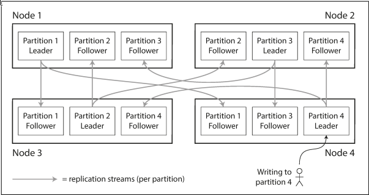
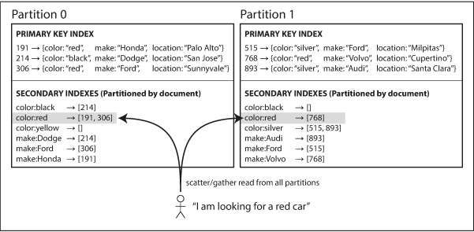
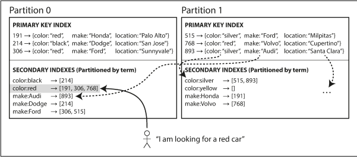
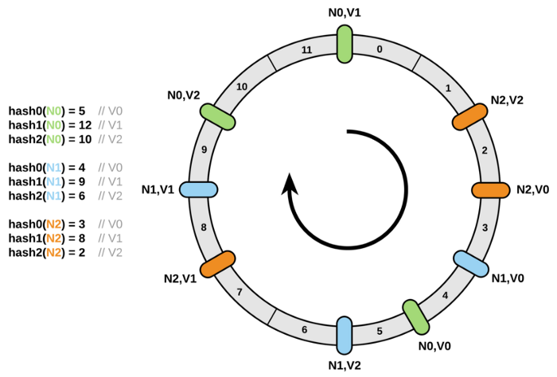

# 6. Partitioning

Replication, for very large datasets or very high query throughput is not sufficient, we need to break the data up into _partitions_ (_sharding_).

Basically, each partition is a small database of its own.

The main reason for wanting to partition data is _scalability_, query load can be load can be distributed across many processors. Throughput can be scaled by adding more node. Certain queries can be executed on only one partition. Large, complex queries can potentially be parallelized across many nodes.

## Partitioning and replication

Each record belongs to exactly one partition, it may still be stored on several nodes for fault tolerance.

A node may store more than one partition. If a leader-follower replication model is used, the combination of partitioning and replication can look like Figure 6-1.

## Partition of key-value data

Our goal with partitioning is to spread the data and the query load evenly across nodes.

If partition is unfair, so that some partitions have more data or queries than others, we call it _skewed_. It makes partitioning much less effective. A partition with disproportionately high load is called a _hot spot_.

The simplest approach is to assign records to nodes randomly. The main disadvantage is that if you are trying to read a particular item, you have no way of knowing which node it is on, so you have to query all nodes in parallel.

### Partition by key range

Assign a continuous range of keys to each partition, like the volumes of a paper encyclopedia. Boundaries might be chose manually by an administrator, or the database can choose them automatically.

On each partition, keys are in sorted order so scans are easy. The downside is that certain access patterns can lead to hot spots. For example, if the key is a timestamp, then the partitions correspond to ranges of time - e.g. one partition per day. Since we write data from the sensors to the database as the measurements happen, all the writes will go to the same partition while no writes will go to the others.

### Partitioning by hash of key

A good hash function takes skewed data and makes it uniformly distributed. There is no need to be cryptographically strong (Cassandra uses MD5). You can assign each partition a range of hashes. The boundaries can be evenly spaced or they can be chosen pseudorandomly (_consistent hashing_).

Unfortunately we lose the ability to do efficient range queries. Keys that were once adjacent are now scattered across all the partitions. Any range query has to be sent to all partitions.

Cassandra achieves a compromise between the two partitioning strategies. Cassandra allows declaring a _compound primary key_ consisting of several columns. Only the first part of that key is hashed to determine the partition, but the other columns are used as a concatenated index for sorting the data in Cassandra's SSTables. A query therefore cannot search for a range of values within the first column of the key, but if it specifies a fixed value for the first column, it can perform an efficient range scan over the other columns of the key.

This is good for one-to-many relationships. For example, one user may post many updates so we can have our key be `(user_id, update_timestamp)`. All records for each user will be on the same partition.

### Skewed workloads and relieving hot spots

You can't avoid hot spots entirely. For example, you may end up with large volume of writes to the same key when a celebrity tweets and many people comment.

It's the responsibility of the application to reduce the skew. A simple technique is to add a random number to the beginning or end of the key. However, splitting writes across different keys makes reads now to do some extra work as it has to read all the possible split keys.

## Partitioning and secondary indexes

The situation gets more complicated if secondary indexes are involved. A secondary index usually doesn't identify the record uniquely. They don't map neatly to partitions.

### Local Secondary Indexes (Partitioning secondary indexes by Document)

Each partition maintains its secondary indexes, covering only the documents in that partition (_local index_). It's called document partitioned, because the information related to a document is stored on its own partition.

Writes will only go to the partition that contains the primary key.

For reads, you need to send the query to _all_ partitions, and combine all the results you get back (_scatter/gather_). This is prone to tail latency amplification and is widely used in MongoDB, Riak, Cassandra, Elasticsearch, SolrCloud and VoltDB.

### Global Secondary Indexe (Partitioning secondary indexes by Term)

We construct a _global index_ that covers data in all partitions. However, we can't just store that index on one node. The global index must also be partitioned so it doesn't become the bottleneck.

It is called the _term-partitioned_ because the term we're looking for determines the partition of the index.

Partitioning by term can be useful for range scans, whereas partitioning on a hash of the term gives a more even distribution load.

The advantage is that it can make reads more efficient: rather than doing scatter/gather over all partitions, a client only needs to make a request to the partition containing the term that it wants. The downside of a global index is that writes are slower and complicated because a write may now affect multiple partitions (every indexed term in the document might be on a different partition).

## Rebalancing partitions

Over time, the requirements of the database may change.

- Query throughput increases, so you want to add mroe CPUs to handle the load.
- The dataset size increases, so you want to add more disks and RAM to store it.
- A machine fails, and other machines need ot take over the failed machine.
  
### Strategies for rebalancing

#### How not to do it: Hash mod n

The problem with _mod N_ is that if the number of nodes _N_ changes, most of the keys will need to be moved from one node to another. Personally, I think this is fine as long as you use _Consistent Hashing_ in a ring with virtual nodes. Placing the nodes in a ring make it so that adding/removing a node only affects the load for 1 node. The problem with just a ring is that load can become skewed especially when a node is removed.

The solution is to create virtual servers/nodes. Generate K replica ids for each server id (designing K hash functions while maintaining random uniformity and consistency is hard)Generating K replica ids is easy: xxx gives K replicas xxx + '1', xxx + '2', ..., xxx + 'K'. Then you take these replicas and generate K points on the ring with the same hash function.

So when a node goes down, it's not one point on the ring that goes away. Its K points that go away affecting K other nodes, but this load is now split up on the remaining nodes evenly.

#### Fixed number of partitions

Create many more partitions than there are nodes and assign several partitions to each node. If a node is added to the cluster, we can _steal_ a few partitions from every existing node until partitions are fairly distributed once again. The number of partitions does not change, nor does the assignment of keys to partitions. The only thing that change is the assignment of partitions to nodes. This is used in Riak, Elasticsearch, Couchbase, and Voldemport. **You need to choose a high enough number of partitions to accomodate future growth.** Neither too big or too small.

#### Dynamic partitioning

The number of partitions adapts to the total data volume. An empty database starts with an empty partition. While the dataset is small, all writes have to processed by a single node while the others nodes sit idle. HBase and MongoDB allow an initial set of partitions to be configured (_pre-splitting_).

#### Partitioning proportionally to nodes

Cassandra and Ketama make the number of partitions proportional to the number of nodes. Have a fixed number of partitions _per node_. This approach also keeps the size of each partition fairly stable. When a new node joins the cluster, it randomly chooses a fixed number of existing partitions to split, and then takes ownership of 1/2 of each of those split partition while leaving the other half of each partition in place.

### Automatic versus manual rebalancing

Fully automated rebalancing may seem convenient but the process can overload the network or the nodes and harm the performance of other requests while the rebalancing is in progress.

It can be good to have a human in the loop for rebalancing. You may avoid operational surprises.

## Request routing

This problem is also called _service discovery_. There are different approaches:

1. Allow clients to contact any node and make them handle the request directly, or forward the request to the appropriate node.
2. Send all requests from clients to a routing tier first that acts as a partition-aware load balancer.
3. Make clients aware of the partitioning and the assignment of partitions to nodes.

In many cases the problem is: how does the component making the routing decision learn about changes in the assignment of partitions to nodes?

Many distributed data systems rely on a separate coordination service such as ZooKeeper to keep track of this cluster metadata. Each node registers itself in ZooKeeper, and ZooKeeper maintains the authoritative mapping of partitions to nodes. The routing tier or the partitioning-aware client, can subscribe to this information in ZooKeeper. HBase, SolrCloud and Kafka use ZooKeeper to track partition assignment. MongoDB relies on its own _config server_. Cassandra and Riak take a different approach: they use a _gossip protocol_.

### Parallel query execution

_Massively parallel processing_ (MPP) relational database products are much more sophisticated in the types of queries they support.
