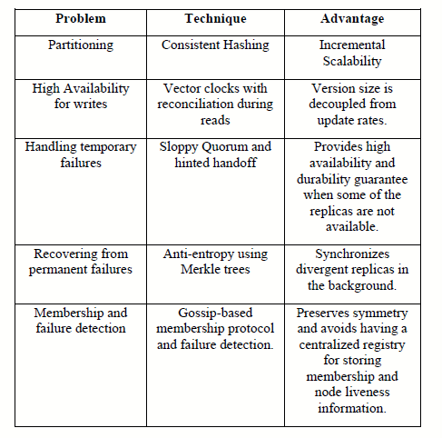
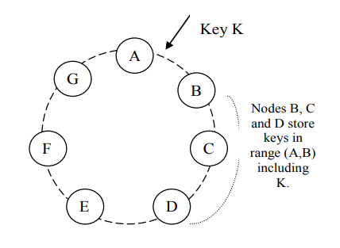

# Dynamo

Dynamo: Amazon’s Highly Available Key-value Store

*A highly available key-value storage system for "always-on" experience.*

## Background

- The Amazon platform is built on top of tens of thousands of server and network components, where there are always a small but significant number of components failing at any given time.
- Some applications like shopping cart need always-available storage technologies for customer experience.

## Introduction

- Dynamo provides only simple key-value interface; no operations span multiple data items.
- Unlike traditional commercial systems putting importance on consistency, Dynamo sacrifices consistency under certain failure scenarios for availability.
- Dynamo uses a synthesis of well known techniques to achieve scalability and availability:

## System Architecture

- **Consistent hashing:** To scale incrementally, Dynamo uses consistent hashing to partition data. The principle advantage is that arrival/departure of a node only affects immediate neighbors.
- **Virtual node**: Dynamo introduces the concept of virtual nodes to balance the load when membership changes and account for heterogeneity in the physical infrastructure (virtual nodes on same physical node are skipped in replication).
- **Data Versioning**: Dynamo uses vector clocks(list of <node, counter\> pairs) to capture the causality between different  versions of the same object. If Dynamo can't resolve divergent versions, it will return all objects and let applications resolve the conflicts.
- **Sloppy quorum and hinted handoff:** Dynamo uses quorum-based consistency protocol(R+W>N),  but does not ensure strict quorum membership. When a node A is temporarily unavailable, another node B will help maintain the replica and deliver the replica to A when detecting A has recovered.
- **Replica synchronization:** Dynamo anti-entropy protocol uses hash trees to reduce the amount of data need to be transferred to detect replica inconsistencies.
- **Gossip protocol:** Each node contacts a random peer every second and two nodes reconcile their persisted membership change histories and views of failure state. To prevent logical partitions, some seed nodes are known to all nodes.

## Consistent Hashing

- Dynamo’s partitioning scheme relies on consistent hashing to distribute the load across multiple storage hosts. 
- In consistent hashing, the output range of a hash function is treated as a fixed circular space or “ring”
  - Each node in the system is assigned a random value within this space which represents its “position” on the ring. 
  - Each data item identified by a key is assigned to a node by hashing the data item’s key to yield its position on the ring, and then walking the ring clockwise to find the first node with a position larger than the item’s position. 
  - Thus, each node becomes responsible for the region in the ring between it and its predecessor node on the ring. 
  - The principle advantage is that departure or arrival of a node only affects its immediate neighbors and other nodes remain unaffected. 
- The basic consistent hashing algorithm presents some challenges. 
  - First, the random position assignment of each node on the ring leads to non-uniform data and load distribution. 
  - Second, the basic algorithm is oblivious to the heterogeneity in the performance of nodes. 
- To address these issues, Dynamo uses a variant of consistent hashing: 
  - instead of mapping a node to a single point in the circle, each node gets assigned to multiple points in the ring. 
  - To this end, Dynamo uses the concept of “virtual nodes”. A virtual node looks like a single node in the system, but each node can be responsible for more than one virtual node
  - Effectively, when a new node is added to the system, it is assigned multiple positions (henceforth, “tokens”) in the ring. 
- Using virtual nodes has the following advantages:
  - If a node becomes unavailable (due to failures or routine maintenance), the load handled by this node is evenly dispersed across the remaining available nodes.
  - When a node becomes available again, or a new node is added to the system, the newly available node accepts a roughly equivalent amount of load from each of the other available nodes.
  - The number of virtual nodes that a node is responsible can decided based on its capacity, accounting for heterogeneity in the physical infrastructure.