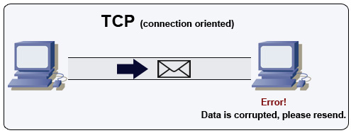
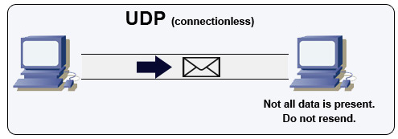
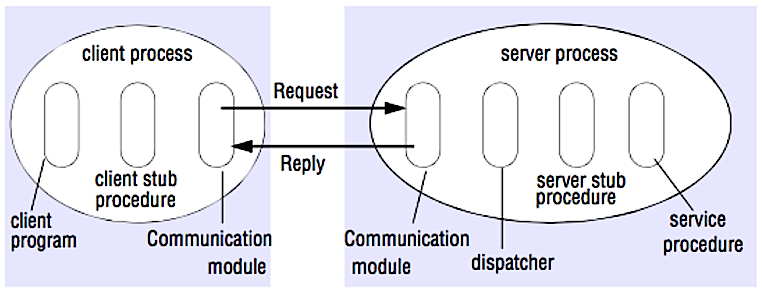

# Communication

## HTTP

HTTP is a method for encoding and transporting data between a client and a server. It is a request/response protocol: clients issue requests and servers issue responses with relevant content and completion status info about the request. HTTP is self-contained, allowing requests and responses to flow through many intermediate routers and servers that perform load balancing, caching, encryption, and compression.

A basic HTTP request consists of a verb (method) and a resource (endpoint). Below are common HTTP verbs:

| Verb | Description | Idempotent* | Safe | Cacheable |
| --- | --- | --- | --- | --- |
| GET | Reads a resource | Yes | Yes | Yes |
| POST | Creates a resource or trigger a process that handles data | No | No | Yes if response contains freshness info |
| PUT | Creates or replace a resource | Yes | No | No |
| PATCH | Partially updates a resource | No | No | Yes if response contains freshness info |
| DELETE | Deletes a resource | Yes | No | No |

*Can be called many times without different outcomes.

HTTP is an application layer protocol relying on lower-level protocols such as **TCP** and **UDP**.

## TCP

TCP is a connection-oriented protocol over an [IP network](https://en.wikipedia.org/wiki/Internet_Protocol). Connection is established and terminated using a [handshake](https://en.wikipedia.org/wiki/Handshaking). All packets sent are guaranteed to reach the destination in the original order and without corruption through:

- Sequence numbers and [checksum fields](https://en.wikipedia.org/wiki/Transmission_Control_Protocol#Checksum_computation) for each packet
- [Acknowledgement](https://en.wikipedia.org/wiki/Acknowledgement_(data_networks)) packets and automatic retransmission

If the sender does not receive a correct response, it will resend the packets. If there are multiple timeouts, the connection is dropped. TCP also implements [flow control](https://en.wikipedia.org/wiki/Flow_control_(data)) and [congestion control](https://en.wikipedia.org/wiki/Network_congestion#Congestion_control). These guarantees cause delays and generally result in less efficient transmission than UDP.

To ensure high throughput, web servers can keep a large number of TCP connections open, resulting in high memory usage. It can be expensive to have a large number of open connections between web server threads and say, a [memcached](https://memcached.org/) server. [Connection pooling](https://en.wikipedia.org/wiki/Connection_pool) can help in addition to switching to UDP where applicable.

TCP is useful for applications that require high reliability but are less time critical. Some examples include web servers, database info, SMTP, FTP, and SSH.

Use TCP over UDP when:

- You need all of the data to arrive intact
- You want to automatically make a best estimate use of the network throughput

## UDP

UDP is connectionless. Datagrams (analogous to packets) are guaranteed only at the datagram level. Datagrams might reach their destination out of order or not at all. UDP does not support congestion control. Without the guarantees that TCP support, UDP is generally more efficient.

UDP can broadcast, sending datagrams to all devices on the subnet. This is useful with [DHCP](https://en.wikipedia.org/wiki/Dynamic_Host_Configuration_Protocol) because the client has not yet received an IP address, thus preventing a way for TCP to stream without the IP address.

UDP is less reliable but works well in real time use cases such as VoIP, video chat, streaming, and realtime multiplayer games.

Use UDP over TCP when:

- You need the lowest latency
- Late data is worse than loss of data
- You want to implement your own error correction

## RPC

In an RPC, a client causes a procedure to execute on a different address space, usually a remote server. The procedure is coded as if it were a local procedure call, abstracting away the details of how to communicate with the server from the client program. Remote calls are usually slower and less reliable than local calls so it is helpful to distinguish RPC calls from local calls. Popular RPC frameworks include [Protobuf](https://developers.google.com/protocol-buffers/), [Thrift](https://thrift.apache.org/), and [Avro](https://avro.apache.org/docs/current/).

RPC is a request-response protocol:

- Client program - Calls the client stub procedure. The parameters are pushed onto the stack like a local procedure call.
- Client stub procedure - Marshals (packs) procedure id and arguments into a request message.
- Client communication module - OS sends the message from the client to the server.
- Server communication module - OS passes the incoming packets to the server stub procedure.
- Server stub procedure - Unmarshalls the results, calls the server procedure matching the procedure id and passes the given arguments.
- The server response repeats the steps above in reverse order.

HTTP APIs following REST tend to be used more often for public APIs.

## REST vs RPC API's

Don't confuse RPC API with RPC connection.

Consider the following example of HTTP APIs that model orders being placed in a restaurant.

- The **RPC API** thinks in terms of "verbs", exposing the restaurant functionality as function calls that accept parameters, and invokes these functions via the HTTP verb that seems most appropriate - a 'get' for a query, and so on, but the name of the verb is purely incidental and has no real bearing on the actual functionality, since **you're calling a different URL each time**. Return codes are hand-coded, and part of the service contract.
- The **REST API**, in contrast, models the various entities within the problem domain as resources, and uses HTTP verbs to represent transactions against these resources - POST to create, PUT to update, and GET to read. **All of these verbs, invoked on the same URL**, provide different functionality. Common HTTP return codes are used to convey status of the requests.

Placing an Order:

- RPC: `http://myrestaurant:8080/Orders/PlaceOrder` (POST: {Tacos object})
- REST: `http://MyRestaurant:8080/Orders/Order?OrderNumber=asdf` (POST: {Tacos object})

Retrieving an Order:

- RPC: `http://MyRestaurant:8080/Orders/GetOrder?OrderNumber=asdf`(GET)
- REST: `http://myrestaurant:8080/Orders/Order?OrderNumber=asdf` (GET)

Updating an Order:

- RPC: `http://MyRestaurant:8080/Orders/UpdateOrder` (PUT: {Pineapple Tacos object})
- REST: `http://MyRestaurant:8080/Orders/Order?OrderNumber=asdf` (PUT: {Pineapple Tacos object})
