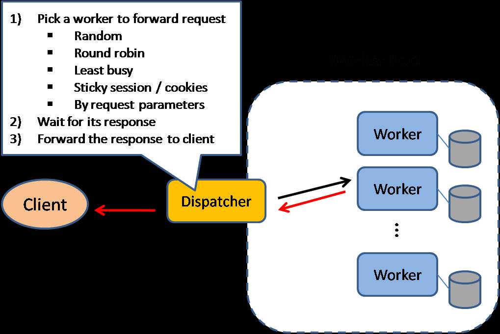

# Load Balancer

Load balancers distribute incoming client requests to computing resources such as application servers and databases. In each case, the load balancer returns the response from the computing resource to the appropriate client. Load balancers are effective at:

## Advantages 

- Preventing requests from going to unhealthy servers
- Preventing overloading resources
- Helping to eliminate a single point of failure
- SSL termination - Decrypt incoming requests and encrypt server responses so backend servers do not have to perform these potentially expensive operations
- Session persistence - Issue cookies and route a specific client's requests to same instance if the web apps do not keep track of sessions
  
## Disadvantages

- The load balancer can become a performance bottleneck if it does not have enough resources or if it is not configured properly.
- Introducing a load balancer to help eliminate a single point of failure results in increased complexity.
- A single load balancer is a single point of failure, configuring multiple load balancers further increases complexity.
Load balancers can be implemented with hardware (expensive) or with software such as HAProxy.

----------------------------

To protect against failures, it's common to set up multiple load balancers, either in [active-passive](https://github.com/donnemartin/system-design-primer#active-passive) or [active-active](https://github.com/donnemartin/system-design-primer#active-active) mode.

Load balancers can route traffic based on various metrics, including:

- Random
- Least loaded
- Session/cookies
- Round robin or weighted round robin
- Layer 4
- Layer 7
  
## Layer 4 load balancing

Layer 4 load balancers look at info at the [transport layer](https://github.com/donnemartin/system-design-primer#communication) to decide how to distribute requests. Generally, this involves the source, destination IP addresses, and ports in the header, but not the contents of the packet. Layer 4 load balancers forward network packets to and from the upstream server, performing [Network Address Translation (NAT)](https://www.nginx.com/resources/glossary/layer-4-load-balancing/).

## Layer 7 load balancing

Layer 7 load balancers look at the [application layer](https://github.com/donnemartin/system-design-primer#communication) to decide how to distribute requests. This can involve contents of the header, message, and cookies. Layer 7 load balancers terminate network traffic, reads the message, makes a load-balancing decision, then opens a connection to the selected server. For example, a layer 7 load balancer can direct video traffic to servers that host videos while directing more sensitive user billing traffic to security-hardened servers.

At the cost of flexibility, layer 4 load balancing requires less time and computing resources than Layer 7, although the performance impact can be minimal on modern commodity hardware.

## Horizontal scaling

Load balancers can also help with horizontal scaling, improving performance and availability. Scaling out using commodity machines is more cost efficient and results in higher availability than scaling up a single server on more expensive hardware, called Vertical Scaling. It is also easier to hire for talent working on commodity hardware than it is for specialized enterprise systems.

### Disadvantage(s): horizontal scaling

- Scaling horizontally introduces complexity and involves cloning servers
  - Servers should be stateless: they should not contain any user-related data like sessions or profile pictures
  - Sessions can be stored in a centralized data store such as a [database](https://github.com/donnemartin/system-design-primer#database) (SQL, NoSQL) or a persistent [cache](https://github.com/donnemartin/system-design-primer#cache) (Redis, Memcached)
- Downstream servers such as caches and databases need to handle more simultaneous connections as upstream servers scale out
