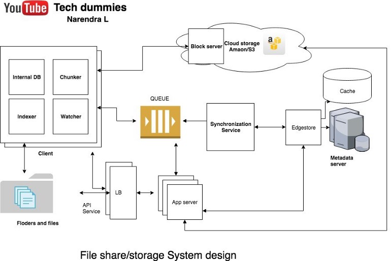

# Dropbox

Random notes about Dropbox architecture

1. Sharded Metadata DDB
   1. Schema
      1. PK: file_id
      2. SK: version_id (version of folder containing item, not item itself!)
      3. `List<chunk_file_path>` containing locations of each chunk in the current version in S3.
      4. `List<Hash of each chunk>` containing hash of each chunk. Lets us find changes quickly.
      5. Other attributes
   2. Versioning by storing 1 row for each file + version. Each row will have list of chunks
2. Files stored in S3 at a chunk level
   1. Files should be stored in **4 Mb Chunks**
   2. We should **encrypt** each block due to security reasons.
   3. Easier file uploads incase of failures
   4. We can easily find which chunks have changed by taking hash of each chunk and comparing whats in Metadata Table
3. We can send update to user by comparing chunk list of their current version and the latest version in Metadata table and sending proper chunks to user.
4. Short polling has alot of network overhead. Websockets optimal as there will be alot of 
5. We should store versionId at a folder level in metadata table instead of at an item level. This way we can lookup whether a device is up to date very fast and find which files need updating by doing a query on index folder_id_version_id > folder_id_X
6. We can store device_id_folder_id -> version_id to have latest versionId per device per folder. This way push service
   can know if it even needs to push. We can also just do max of metadata table index folder_id_version_id

## Client Application

The main components of the desktop client are Watcher, Chunker, Indexer, and Internal DB as described below.

- Watcher monitors the sync folders and notifies the Indexer of any action performed by the user for example when user create, delete, or update files or folders.
- Chunker splits the files into smaller pieces called chunks. To reconstruct a file, chunks will be joined back together in the correct order. A chunking algorithm can detect the parts of the files that have been modified by user and only transfer those parts to the Cloud Storage, saving on cloud storage space, bandwidth usage, and synchronization time.
- Indexer processes the events received from the Watcher and updates the internal database with information about the chunks of the modified files. Once the chunks are successfully submitted to the Cloud Storage, the Indexer will communicate with the Synchronization Service using the Message Queuing Service to update the Metadata Database with the changes.
- Internal Database keeps track of the chunks, files, their versions, and their location in the file system

## FROM SQL WEBSITE