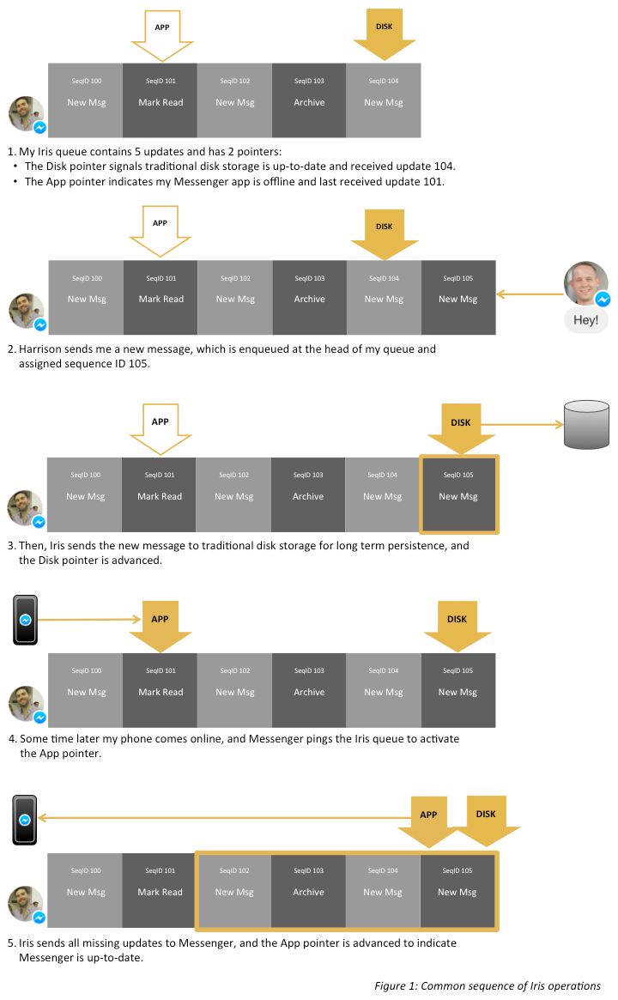

# Iris - Building Mobile-First Infrastructure for Messenger

## Clients

The original protocol for getting data down to Messenger apps was pull-based. When receiving a message, the app first received a lightweight push notification indicating new data was available. This triggered the app to send the server a complicated HTTPS query and receive a very large JSON response with the updated conversation view.

Instead of this model, we decided to move to a push-based snapshot + delta model. In this model, the client retrieves an initial snapshot of their messages (typically the only HTTPS pull ever made) and then subscribes to delta updates, which are immediately pushed to the app through **MQTT** (a low-power, low-bandwidth protocol) as messages are received. When the client is pushed an update, it simply applies them to its local copy of the snapshot. As a result, without ever making an HTTPS request, the app can quickly display an up-to-date view.

We further optimized this flow by moving away from JSON to Thrift which allowed us to reduce our payload size on the wire by roughly 50%.

## Servers

Messaging data has traditionally been stored on spinning disks. In the pull-based model, we’d write to disk before sending a trigger to Messenger to read from disk. Thus, this giant storage tier would serve real-time message data as well as the full conversation history. **One large storage tier doesn't scale well to synchronize recent messages to the app in real time. So in order to support this new, faster sync protocol and maintain consistency between the Messenger app and long-term storage, we need to be able to stream the same sequence of updates in real time to Messenger and to the storage tier in parallel on a per user basis.**

**Iris is a totally ordered queue of messaging updates (new messages, state change for messages read, etc.) with separate pointers into the queue indicating the last update sent to your Messenger app and the traditional storage tier.** When successfully sending a message to disk or to your phone, the corresponding pointer is advanced. When your phone is offline, or there is a disk outage, the pointer stays in place while new messages can still be enqueued and other pointers advanced. As a result, long disk write latencies don't hinder Messenger's real-time communication, and we can keep Messenger and the traditional storage tier in sync at independent rates.

Effectively, this queue allows a tiered storage model based on recency:

- The most recent messages are immediately sent to online apps and to the disk storage tier from Iris's memory
- A week's worth of messages are served by the queue's backing store in the case of disk outage or the Messenger app being offline for a while
- Older conversation history and full inbox snapshot fetches are served from the traditional disk storage tier

We opted to build the queue storage on top of **MySQL** and flash. For MySQL we decided to use **semi-sync replication**, which can give you durability across multiple servers. By leveraging this technology, we can handle database hardware failures in under 30 seconds, and the latency for enqueueing a new message is an order of magnitude less than writing to the traditional disk storage. **Since we enqueue a message once to MySQL and then push it to apps and disk in parallel, Messenger receives messages faster and more reliably.**[1]

## Lessons learned

- **By sending less data and reducing HTTPS fetches, apps receive updates with lower latency and higher reliability.**
  - The network is a scarce resource that must be used as efficiently as possible.
  - Every byte wasted has a very real impact on the experience of the application.
- Extending desktop-focused infrastructure for a mobile world could work well, but building new mobile first infrastructure with protocols designed for pushable devices offers even better experiences.
