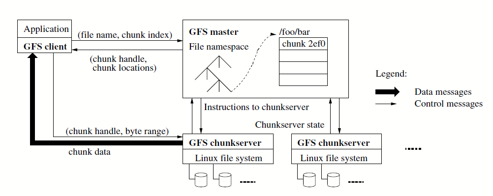

# The Google File System

*A scalable distributed file system for large distributed data-intensive applications.*

## Introduction

- The design is driven by key observations different from earlier file system assumptions, including frequent component failures, huge files and  that most files are mutated by appending rather than overwriting.
- GFS provides a POSIX-like file system interface. It supports snapshot and record append operations(useful for multi-way merge and consumer/producer).

## Architecture

- A GFS cluster consists of a single master and multiple chunkservers and is accessed by multiple clients.
- Files are divided into fixed-sized chunks(64 MB, larger than typical) and each chunk has an immutable and globally unique id. Chunkservers store chunks as local Linux files and the master maintains all file system metadata.
- The master stores in memory three majors types of metadata: the file and chunk namespaces, the mapping from files to chunks and the locations of each chunk's replicas. The first two are also persisted in a replicated operation log(with checkpoints); the last one is polled from chunkservers at start time and kept up-to-date via heartbeat messages.

## System Interactions

- For mutations to a chunk, the master grants an extendable chunk lease to one of the replicas. The primary will pick a serial order for all mutations to the chunk and all replicas will follow this order.
- Control and data flows are decoupled to use the network efficiently. Control flows from the client to the primary and then to all secodaries,.Data is pushed linearly along a carefully picked chain of chunkservers in a pipelined fashion.
- GFS provides at-least-once semantics. A client retries when mutation fails, so replicas of the same chunk may contain different data including duplicates or paddings(not bytewise identical).

## Master Operations

- GFS namespace is represented as a lookup table(with prefix compression) from full pathnames to metadata. Each file or directory has a read-write lock to ensure proper searialization.
- The master create chunk replicas for  initial creation, re-replication and rebalancing. It considers various factors when placing the replica, to maximizing data reliability/availability and network bandwidth utilization.
- When a file is deleted, the master logs the deletion immediately but deletes metadata after some delay(3 days, etc). Each chunkserver reports a subset of chunks in heartbeat messages, and the master replies whether these chunks can be deleted. This lazy approach is simple and reliable in a large-scale distributed system.
- The master maintains a version number for each chunk. Whenever the master grants a new lease on the chunk, it increases the version number and informs all the up-to-date replicas.
- For high availability, we have (1) monitoring infrastructure outside GFS to start a master and (2) "shadow" masters for read-only operations.