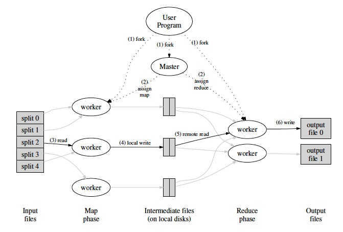

#[MapReduce: Simplified Data Processing on Large Clusters](http://nil.csail.mit.edu/6.824/2020/papers/mapreduce.pdf)

*A programming model and an associated implementation for processing and generating large data sets.*

## Introduction

- Many computation tasks are conceptually straightforward, but given the size of input data, the computations have to be distributed across machines to finish in a reasonable amount of time.
- MapReduce is an abstraction that can express many computation tasks while hiding details of parallelization, fault-tolerance, data distribution and load balancing.
- Users specify a map function that processes a key/value pair to generate a set of intermediate key/value pairs, and a reduce function that merges all intermediate values associated with the same intermediate key.

```
map (k1,v1) → list(k2,v2)
reduce (k2,list(v2)) → list(v2)
```

<center></center>

## Implementation

### Execution

- A single master assigns tasks to workers; there are M map tasks and R reduce tasks in total.
- For map task, worker reads input, applies user-defined Map function and periodically writes intermediate results buffered in memory to local disk partitioned into R regions. The locations of these buffered pairs on disk are passed back to the master, who forwards these locations to the reduce workers.
- For reduce task, worker uses rpcs to read intermediate results on map workers' local disks, sorts intermediate results to group occurrences of the same key, applies user-defined Reduce function and writes final results to a global file system.
- Master is responsible of propagating the locations of intermediate files from map tasks to reduce tasks.

### Master Data Structures

* stores state(idle, in-progress, competed) and identity of the worker machine for each task (non idle).
* for each completed map task: locations and sizes of the R intermediate file regions. The information is pushed incrementally to in-progress reduce workers.

### Fault Tolerance

- For worker failure, master periodically pings workers and marks the worker that has no response for a certain amount of time as failed. Completed and in-progress map tasks are reset to idle and reduce workers executing are notified.
- Completed map tasks and any in-progress tasks on that worker are rescheduled to other workers; no need to re-execute completed reduce tasks because output is stored in global file system instead of worker's local disk.
- For master failure, the computation is just aborted and it is client's responsibility to check and retry.

### Miscellaneous

- **Locality:** master attempts to schedule map tasks on or close to the machines that contains corresponding input data(input data managed by GFS is also stored in the cluster).
- **Task granularity:** ideally M and R should be large to improve load balancing and speed up failure recovery, but there are practical bounds since master needs to keep $O(M\times R)$ states in memory and each reduce task produces a separate output file.
- **Backup tasks:** when the MapReduce is close to completion, master schedules backup executions for remaining in-progress tasks to alleviate the problem of stragglers. MR takes 44% longer without backup tasks.

## Refinements

- **Partitioning Function:** Typically`hash(key) mod R` is used for hashing. However, it is useful to allow custom partitioning function so that for example users can have all URLs from the same host end up in the same output file.
- **Combiner Function:** In some cases, there is significant repetition in the intermediate keys produced by each map task. For example, word count map produces`<word, 1>` for each word. All of these counts will be sent over RPC. Better allow user to specify optional Combiner that does partial merging of data before sent to reducers.
