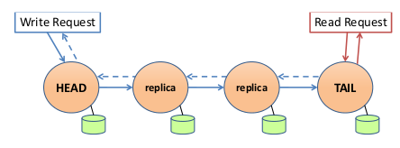
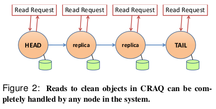

# CRAQ

[Object Storage on CRAQ](http://nil.csail.mit.edu/6.824/2020/papers/craq.pdf)

*High-throughput chain replication for read-mostly workloads.*

MIT [Notes](http://nil.csail.mit.edu/6.824/2020/notes/l-craq.txt) , [FAQ](http://nil.csail.mit.edu/6.824/2020/papers/craq-faq.txt)

## Introduction

**Chain Replication with Apportioned Queries (CRAQ)** is an improvement to chain replication. It distributes the load on all object copies to greatly improve read throughput while maintaining strong consistency.

This article mainly summarizes the chain replication, the principle of **CRAQ**, and the consistency model of **CRAQ**.

### Chain Replication

**Chain Replication (CR)** is a method of replicating data across multiple nodes:



- The nodes form a chain of length *C*
- The head node of the chain handles all write operations from the client
- When a node receives a write operation, it will propagate to every node in the chain
- Once the write reaches the tail node, it is applied to all copies in the chain and is considered committed
- When the tail node submits a write operation, it will notify up the chain and head will respond to the client
- The tail node handles all read operations, so only the submitted value can be returned by the read operation

Chain replication achieves **strong consistency**: Since all read operations are performed at the tail, and all write operations are committed at the tail, the chain tail can simply apply a total sequence to all operations.

**Tradeoffs vs Raft**

Both CRAQ and Raft/Paxos are replicated state machines. They can be used to replicate any service that can be fit into a state machine mold (basically, processes a stream of requests one at a time). One application for Raft/Paxos is object storage.

CR and CRAQ are likely to be faster than protocols like Raft that provide *strong consistency* because the CR head does less work than the Raft leader:

- the CR head sends writes to just one replica, while the Raft leader must send all operations to all followers.
- CR has a performance advantage for reads as well, since it serves them from the tail (not the head), while the Raft leader must serve all client requests.

However, Raft/Paxos and CR/CRAQ differ significantly in their failure properties.

- Raft (and Paxos and ZooKeeper) can continue operating (with no pauses at all) even if a minority of nodes are crashed, slow, unreliable, or partitioned.
- A CRAQ or CR chain must stop if something like that goes wrong, and wait for a configuration manager to decide how to proceed.
- On the other hand the post-failure situation is significantly simpler in CR/CRAQ; recall Figures 7 and 8 in the Raft paper.

**Failure recovery** for chain replication:

- When the head node fails: the subsequent node replaces it as the head node, and there is no missing committed write operation
- When the tail node fails: the previous node replaces it as the tail node, and there is no lost write operation
- When the intermediate node fails: removed from the chain, the previous node needs to resend the most recent write operation

**Limitations**: All reads of an object must go to the tail node, resulting in heavy load.

***

## CRAQ




### CRAQ Principles

**CRAQ** is an improvement of chain replication which allows any node in the chain to perform read operations:

- *CRAQ* Each node can store multiple versions of an object, and each version contains a monotonically increasing version number and an additional attribute (identifying `clean` or `dirty`)

- When a node receives a new version of an object (via a write operation that propagates down), the node appends this latest version to the list of the object
  - If the node is not the tail node, mark the version as `dirty` and pass the write operation to subsequent nodes
  - If the node is the tail node, the version is marked as `clean`, at this time the write operation is `committed`. Then, the tail node sends `ACK` back in the chain to notify other nodes to submit
- When the `ACK` of the object version arrives at the node, the node will mark the object version as `clean`. The node can then delete all previous versions of the object
- When the node receives a read request from the object:
  -If the latest known version of the requested object is clean, the node will return this value
  -Otherwise, the node will contact the tail node and ask for the last submitted version number of the object on the tail node, and then the node will return this version of the object

### Performance Improvement

**CRAQ**'s throughput improvement over **CR** occurs in two different situations:

- **Read-intensive workload**: Read operations can be performed on all nodes, so throughput is linearly proportional to chain length
- **Write-intensive workload**: In workloads with a large number of write operations, it is easier to read `dirty` data, so there are more query requests for tail nodes. However, the workload of querying the tail node is much lower than that of all read requests performed by the tail node, so the throughput of *CRAQ* is higher than that of *CR*.

### Consistency Model

For read operations, *CRAQ* supports three consistency models:

- **Strong Consistency**: The read operation described in *4.1* enables the latest written data to be read for each read, thus providing strong consistency
- **Eventual consistency**: Allow nodes to return uncommitted new data, that is, allow *client* to read inconsistent object versions from different nodes. But for a *client*, since it establishes a session with the node, its read operation is guaranteed to be monotonous and consistent.
- **Eventual consistency with maximum inconsistency boundary**: Nodes are allowed to return uncommitted new data, but there is a limit of inconsistency. This limit can be based on version or time. For example, it is allowed to return newly written but uncommitted data within a period of time.

### ZooKeeper Coordination Service

If the network connection between two adjacent nodes is disconnected, the subsequent node will want to become the head node, which will result in two head nodes.

**CRAQ** itself will not solve such a problem, so an external distributed coordination service is needed to solve this problem, such as using **ZooKeeper**. *ZooKeeper* determines the composition of the chain, determines which node is the head and tail, and monitors which node has failed. When a network failure occurs, *ZooKeeper* determines the new composition of the chain, not based on each node's own perception of the network situation.

Through the use of Zookeper *watch flags*, CRAQ nodes are guaranteed to receive a notification when nodes are added to or removed from a group. Similarly, a node can be notified when metadata in which it has expressed interest changes.

During initialization, a CRAQ node creates an ephemeral file in `/nodes/dc_name/node_id`. CRAQ nodes can query `/nodes/dc_name` to determine the membership list for its datacenter, but instead of having to periodically check the list for changes, ZooKeeper provides processes with the ability to create a watch on a file. A CRAQ node, after creating an ephemeral file to notify other nodes it has joined the system, creates a watch on the children list of `/nodes/dc_name`, thereby guaranteeing that it receives a notification when a node is added or removed.

***

## Alternate Approaches To Improving Chain Replication

A data center will probably have lots of distinct CR chains, each serving a
fraction (shard) of the objects. Suppose you have three servers (S1,
S2, and S3) and three chains (C1, C2, C3). Then you can have the three
chains be:

```
  C1: S1 S2 S3
  C2: S2 S3 S1
  C3: S3 S1 S2
```

Now, assuming activity on the three chains is roughly equal, the load on
the three servers will also be roughly equal. In particular the load of
serving client requests (head and tail) will be roughly equally divided
among the three servers.

This is a pretty reasonable arrangement; **CRAQ is only better if it
turns out that some chains see more load than others**.

***

## Summary

In Chain Replication, only the head and tail directly serve client
requests; the other replicas help fault tolerance but not performance.
Since the load on the head and tail is thus likely to be higher than
the load on intermediate nodes, you could get into a situation where
performance is bottlenecked by head/tail, yet there is plenty of idle
CPU available in the intermediate nodes. CRAQ exploits that idle CPU
by moving the read work to them.
