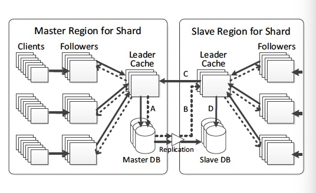

# TAO

TAO: Facebook’s Distributed Data Store for the Social Graph

*A geographically distributed data store that provides efficient and timely access to the social graph.*

## Background

- The content Facebook presents to each user is highly tailored, so we have to perform filtering and aggregation when the content is viewed instead of when the content is created.
- Facebook was originally built with MySQL/PHP/memcache. This look-aside key-value cache architecture has problems like inefficient edge lists, distributed control logic and expensive read-after-write consistency.
- TAO is designed to handle the workload of read-mostly access to a constantly changing graph. Efficiency and availability are explicitly favored over consistency.

## Data Model and API

```
Object:(id) -> (otype, (key -> value))
Association: (id1, atype, id2) -> (time, (key -> value)*)
Association List: (id1, atype) -> [a1, a2, ..., an]
```

- Objects are typed nodes. Each object has a globally unique id.
- Associations are typed directed edges between objects; at most one association can exist between two objects.
- Both objects and associations may contain data as key->value pairs.
- Bidirectional edges are modeled as two associations. TAO keeps associations in sync with their inverses.
- TAO's association queries are organized around association lists(associations in descending order by the "time" field).
- A per-atype upper bound for each query is enforced(`assoc_ranage(id1, atype, pos, limit)`), so the client must issue multiple queries to enumerate a longer association list.

## Architecture

### Basics

- TAO uses MySQL as persistent storage. Data is divided into logical shards and each database server is responsible for one or more shards.
- Each object id has an embedded shard_id(fixed for entire lifetime). An association is stored on the shard of its id1.
- Multiple caching servers together form a tier. Shards are mapped onto cache servers with consistent hashing.
- The TAO in-memory cache contains objects, association lists and association counts. Cache servers understand the semantics of the contents and can use them to answer queries not processed before(example: cache count zero for range query).
- Client issues requests directly to the appropriate cache server, which will complete the read/write request(contact other cache servers/databases if necessary).
- For write operation on an association with inverse, the cache server for id1 will contact the cache server for id2 and issue write to database after the inverse write is complete. TAO does not provide atomicity between two updates; hanging associations are repaired by an asynchronous job.

### Scaling

**Leader and Follower Tiers**

- Larger tiers are problematic because they are prone to hot spots and have O(N^2) growth in all-to-all connections.
- We split the cache into two levels: a leader tier and multiple follow tiers. Leaders behave as the basic case, while followers will instead forward read misses and writes to leaders.
- To keep cache consistent, leaders asynchronously send cache maintenance messages to followers. A version number in message allows it to be ignored when arriving late.

**Geographically**

- Cluster data center locations into a few regions where the intra-region latency is small. Store one copy of the social graph per region.
- Followers behave identically in all regions, forwarding read misses and writes to the local region's tier leader.
- Leaders query the local region's database regardless of whether master or slave. Writes are forwarded by the local leader to the leader in the master region.
- Master region is controlled separately for each shard and is automatically switched to recover from database failure. We prefer to locate all of the master databases in a single region, otherwise inverse write may introduce inter-region latency.



## Consistency

- After a write, TAO guarantees the eventual delivery of an invalidation or refill to all tiers.
- TAO reads marked as critical will be proxied to the master region for stronger consistency.

## Fault Tolerance

- **Database failures:** When a master database is down, one of its slave is promoted to be the new master. When a slave database is down, cache misses are redirected to leaders in the master region.
- **Leader failures:** Followers reroute read misses directly to the database and writes to a random replacement leader.
- **Invalidation and refill failures:** If a follower is unreachable, leader persists messages and redeliver them later. If these messages are lost due to permanent leader failure, a bulk invalidation operation is used to invalidate all data of specific shard in followers.
- **Follower failures:** Client requests are failed over to followers in other tiers.
