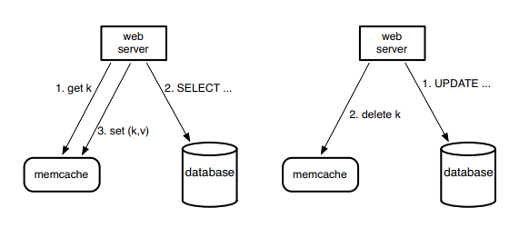
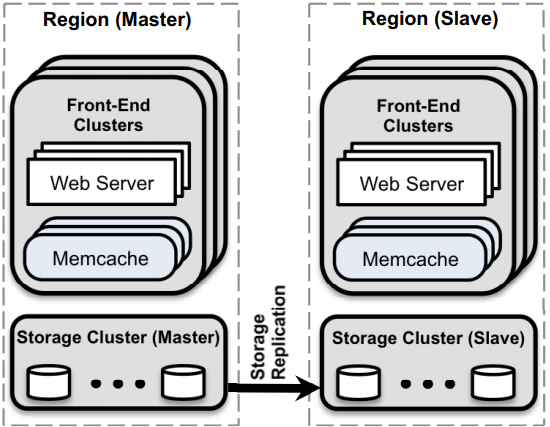
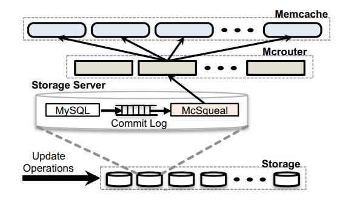

#[Scaling Memcache at Facebook](http://nil.csail.mit.edu/6.824/2020/papers/memcache-fb.pdf)

*How Facebook scaled a distributed key-value store that supports the world’s largest social network*

## History of Application Scaling

Typical story of evolution over time:

- Single machine w/ web server + application + DB
  - DB provides persistent storage, crash recovery, transactions, SQL
  - application queries DB, formats HTML, &c
  - but: as load grows, application takes too much CPU time
- Many web FEs, one shared DB
  - an easy change, since web server + app already separate from storage
  - FEs are stateless, all sharing (and concurrency control) via DB stateless -> any FE can serve any request, no harm from FE crash
  - but: as load grows, need more FEs, soon single DB server is bottleneck
- Many web FEs, data sharded over cluster of DBs
  - partition data by key over the DBs; app looks at key (e.g. user), chooses the right DB
  - good DB parallelism if no data is super-popular
  - painful -- cross-shard transactions and queries probably don't work
    hard to partition too finely
    but: DBs are slow, even for reads, why not cache read requests?
- Many web FEs, many caches for reads, many DBs for writes
  - cost-effective b/c read-heavy and memcached 10x faster than a DB; memcached just an in-memory hash table, very simple
  - complex b/c DB and memcacheds can get out of sync
  - fragile b/c cache misses can easily overload the DB
    (next bottleneck will be DB writes -- hard to solve)

Will partition or replication yield most mc throughput? 

- partition: divide keys over mc servers
- replicate: divide clients over mc servers 
- partition: 
  - (+) more memory-efficient (one copy of each k/v) 
  - (+) works well if no key is very popular 
  - (-) each web server must talk to many mc servers (overhead) 
- replication: 
  - (+) good if a few keys are very popular 
  - (+) fewer TCP connections 
  - (-)  less total data can be cached

## Overview

- FB uses mc as a "look-aside" cache
- application determines relationship of mc to DB mc doesn't know anything about DB
- important to read your own writes

- Q: what is the point of regions -- multiple complete replicas? 
  - lower RTT to users (east coast, west coast) 
  - quick local reads, from local mc and DB (though writes are expensive: must be sent to primary) 
  - maybe hot replica for main site failure?  
- Q: why not partition users over regions? 
  - i.e. why not east-coast users' data in east-coast region, &c 
  - then no need to replicate: might cut hardware costs in half! 
  - but: social net -> not much locality; might work well for e.g. e-mail 
- Q: why OK performance despite all writes forced to go to the primary region? 
  - writes are much rarer than reads 
  - perhaps 100ms to send write to primary, not so bad for human users 
  - users do not wait for all effects of writes to finish; i.e. for all stale cached values to be deleted

## In a Cluster: Latency and Load

### Reducing Latency

- Items are distributed in mc through consistent hashing. Thus web servers have to communicate with many mc servers. N^2 (each web to each mc) (all to all pattern)
- Important practical networking problems: 
  - N^2 TCP connections is too much state; thus UDP for client get()s 
  - UDP is not reliable or orderedl; thus TCP for client set()s and mcrouter to reduce n in n^2 
 -  single request per packet is not efficient (for TCP or UDP) 
    -  per-packet overhead (interrupt &c) is too high 
    -  thus mcrouter batches many requests into each packet

### Reducing Load

- Leases to address two problems: stale sets and thundering herds
- MC gives a lease bound to a specific k to a client to set data back into the cache when the client experiences a cache miss
- Client provides the lease token when setting k in mc
- MC invalidates leases if it receives a delete request 
- Thundering herds:
  - one client updates DB and delete()s a key
  - lots of clients get() but miss 
    - they all fetch from DB
    - they all set()
  - not good: needless DB load 
  - mc gives just the first missing client a "lease" 
    - lease = permission to refresh from DB 
    - mc tells others "try get() again in a few milliseconds" 
  - effect: only one client reads the DB and does set() 
    - others re-try get() later and hopefully hit

## In a Region: Replication

- Why multiple clusters per region? 
  - why not add more and more mc servers to a single cluster? 
  - (1) adding mc servers to cluster doesn't help single popular keys replicating (one copy per cluster) does help 
  - (2) more mcs in cluster -> each client req talks to more servers and more in-cast congestion at requesting web servers client requests fetch 20 to 500 keys! over many mc servers MUST request them in parallel (otherwise total latency too large) so all replies come back at the same time network switches, NIC run out of buffers 
  - (3) hard to build network for single big cluster uniform client/server access so cross-section b/w must be large -- expensive two clusters -> 1/2 the cross-section b/w
- But replicating is a waste of RAM for less-popular items!
  - "regional pool" shared by all clusters
  - unpopular objects (no need for many copies)

### New Clusters

- Bringing up new mc cluster is a performance problem as new cluster has 0% hit rate. Clients that use it will generate a big spike in DB load. If originally 1% miss rate, adding new cluster will cause misses for 50% -> 50x spike in DB load.
- thus the clients of new cluster first get() from existing cluster and set() into new cluster
  - basically lazy copy of existing cluster to new cluster

## Across Regions: Consistency

- Writes go direct to primary DB, with transactions, so writes are consistent 
- Reads eventually consistent but Read-your-own-writes
- How do they keep mc content consistent w/ DB content?
  - DBs send invalidates (delete()s) to all mc servers that might cache; this is McSqueal in Figure 6
  - writing client also invalidates mc in local cluster for read-your-own-writes
- Writes from a master region
  - To avoid a race condition in which an invalidation arrives to a replica mc before the data has been replicated from the master region, mcsqueal implemented so that each DB will notify mcs in its region to invalidate instead of master sending invalidates to all regions
- Writes from a non-master region
  - Consider a user who updates his data from a non-master region when replication lag is excessively large. When this user tries to fetch data, it hits regional replica DB and may see stale data
  - Employs a *remote marker* mechanism to minimalize stale data reads. 
  - When a web server wishes to update data that affects a key k, that server (1) sets a remote marker $r_k$ in the region (2) performs the write to the master embedding $k$ and $r_k$ to be invalidated in the SQL statement (3) deletes $k$ in the local cluster.
  - On a subsequent request for k, a web server will be unable to find the cached data, check whether $r_k$ exists, and direct its query to the master or local region depending on the presence of $r_k$. 