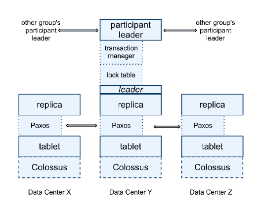

# Spanner: Google’s Globally-Distributed Database

*Google’s scalable, multi-version, globally-distributed and synchronously-replicated database.*

## Introduction

- Bigtable is hard to use for applications need complex, evolving schemas or strong consistency in wide-area replication, so Spanner evolved into a temporal, multi-version, semi-relational database.
- With a new TrueTime API that exposes clock uncertainty, Spanner assigns globally-meaningful commit timestamp to even distributed transactions.
- Spanner shards data across many sets of Paxos state machines in data centers spread all over the world.

## System Architecture

- A Spanner zone has one zonemaster and many spanservers. The former assigns data to spanservers; the latter serve data to clients.
- A spanserver is responsible for 100~1000 tablets. Each tablet contains a bag of mappings $(key:string, timestamp:int64)\rightarrow string$ from multiple partitions of the row space(data colocation). A tablet's state is stored in a set of B-tree like files and a write-ahead log on Colossus.
- A spanserver implements a Paxos state machine on each tablet; each Paxos state machine stores metadata and log in corresponding tablet.
- At every replica that is a leader, each spanserver implements a lock table and a transaction table to support distributed transactions(two-phase commit on mutliple Paxos groups).

## TruetTme

- Main method $TT.now()$ returns an interval [earliest, latest] that is guaranteed to contain the absolute time when $TT.now()$ is invoked. $TT.after(t)$ and $TT.before(t)$ are convenience wrappers.
- TrueTime uses two forms of time references, GPS and atomic clocks, as they have different failure modes.
- TrueTime is implemented by a set of time master machines per data center and a time slave daemon per machine.
- Each daemon polls a variety of masters, apply Marzullo's algorithm to detect liars and synchronize the local machine clock to non-liars.
- Between synchronizations, a daemon advertises a slowly increasing time uncertainty $\epsilon$ (average 4ms in production) derived from worst-case local clock drift, time master uncertainty and communication delay to the time masters.

## Concurrency Control

- Spanner supports read-write transactions, read-only transactions and snapshot reads. Read-only transactions and snapshot reads execute at a specific timestamp without locking.
- Spanner maintains following invariants:
  - **disjointness:*** within a Paxos group, each Paxos leader's lease interval is disjoint from every other leader's.
  - **monotonicity:** within a Paxos group, Paxos writes have monotonically increasing timestamp.
  - **external consistency:** if the start of a transaction $T_2$ occurs after the commit of a transaction $T_1$, then the commit timestamp of  $T_2$ must be greater than the commit timestamp of $T_1$.
- For RW transactions, the coordinator assigns a commit timestamp $S_i$ no later than $TT.now().latest$ computed after receiving the commit request, and waits until $TT.after(S_i)$ is true to apply the commit("commit wait").
- For RO transactions and snapshot reads, every replica tracks $t_{safe}$ for the maximum at which the replica is up-to-date, which depends on the Paxos state machine and if there are prepared but not committed transactions. 