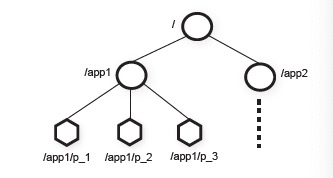
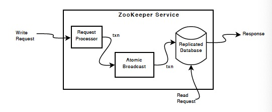

# [ZooKeeper: Wait-free coordination for Internet-scale systems](http://nil.csail.mit.edu/6.824/2020/papers/zookeeper.pdf)

*A service for coordinating processes of distributed applications.*

MIT [Notes](http://nil.csail.mit.edu/6.824/2020/notes/l-zookeeper.txt) , [FAQ](http://nil.csail.mit.edu/6.824/2020/papers/zookeeper-faq.txt)

## Basics

- ZooKeeper provides a coordination kernel for clients to implement primitives for dynamic configuration, group membership, leader election and distributed lock.
- ZooKeeper implements non-blocking API, so a client can have multiple outstanding operations at a time.
- ZooKeeper target workload read to write ratio is 2:1 to 100:1 with data in the MB range. **Best for Read Heavy applications (Ideal for storing configuration information)**
- ZooKeeper relaxes the conditions provided by Raft. Reads are eventually consistent Zookeeper guarantees :  
  - 1) linearizable writes
  - 2) FIFO client ordering for all operations, all requests from a given client are executed in the order that they were sent by the client.

## Service Overview

### znode

- ZooKeeper provides the abstraction of a set of data nodes(znodes) organized by hierarchical namespaces.
- znodes are in-memory data node stored in ZooKeeper. Three types of znodes:
  - regular
  - ephemeral (automatically removed when corresponding session terminates).
  - sequential (when a file is created with a given name, ZooKeeper appends a number. ZooKeeper guarantees to never repeat a number if several clients try to write.)
- znodes are not for general data storage. Instead, they are used to store metadata or configuration of applications(typically 1MB).

### Client API

- ZooKeeper provides API for client to manipulating znodes like in a file system.
- For read methods, ZooKeeper implements watches to allow client to receive notification of changes.  Watches are one-time triggers associated with a session(for example, `getData(path, watch)`).
- For write methods, ZooKeeper accepts an optional expected version number(for example, `setData(path, data, version)`). If set, the write succeeds only if the actual version number of znode matches the expected one.
- ZooKeeper client maintains session with ZooKeeper through heartbeat messages.

1. create(path, data, flags(regular, ephemeral, sequential))
2. delete(path, version): deletes if version matches
3. exists(path, watch): watch is bool
4. getData(path, watch)
5. setData(path, data, version): sets if version matches
6. getChildren(path, watch)
7. sync(path): waits for all pending writes to complete

## Implementation

- ZooKeeper service comprises an ensemble of servers that each has replicated ZooKeeper data. One is leader and the rest are followers.
- Read requests are handled locally at each server, so it may return stale data since some committed transactions are not applied on that server yet.
- Write requests are forwarded to leader. Leader (1) calculates the new system state to transform write requests into idempotent transactions and (2) broadcast the state changes to other servers through atomic broadcast protocol ZAB.
- ZooKeeper uses TCP so message order is maintained by network.
- ZooKeeper uses replay log and periodic snapshots for recoverability. Snapshots are fuzzy since ZooKeeper state is not locked when taking the snapshot. After reboot, ZooKeeper constructs a consistent snapshot by replaying all log entries from the point at which the snapshot started. Because updates in Zookeeper are idempotent and delivered in the same order, the application-state will be correct after reboot.

### Atomic Broadcast

- Zab is an atomic broadcast protocol, uses simple majority quorums to decide on a proposal.
- Leader executes the requests and broadcasts the change to the ZooKeeper state through Zab.
- Zab guarantees the changes broadcast by a leader are delivered in order they were sent and all changes from previous leaders are delivered to an established leader before it broadcasts its own changes.
- TCP for transport so message order is maintained by the network.
- Use log to keep track of proposals as the write-ahead log for the in-memory database.
- 
### Client Server Interactions

- Read is handled locally in memory. Each read request is processed and tagged with a zxid that corresponds to the last transaction seen by the server.
- Zxid defines the partial order of the read requests with respect to the write requests.
- Drawback: not guaranteeing precedence order for read operations, read may return a stale vlue. Should use sync flag to indicate follower to sync with leader.
- Sync: place sync operation at the end of the queue of requests between the leader and the server executing the call to sync.
- If pending queue is empty, the leader needs to issue a null transaction to commit and orders the sync after that transaction. 
- Heartbeat: send heartbeat after the session has been idle for s/3 ms and switch to a new server if it has not heard from a server for 2s/3 ms. s is session timeout in ms.
  
### Use Cases

- Dynamic Configuration In A Distributed Application.
  - Processes startup with the full pathname of zc, a znode storing dynamic configuration.
  - Set watch flag to true, read config file, upon notified and read new configuration, again set the watch flag to true
- Rendezvous
  - Client creates rendezvous node, zr and the full pathnameof zr as a startup parameter of the master and worker processes.
  - When the master starts it fills in zr with information about addresses and ports it is using.
  - When workers start, they read zr with watch set to true.
- Group Membership
  - Designate node, zg to represent the group. 
  - When a process member of the group starts, it creates an ephemeral child znode under zg.
  - Processes can obtain group information by simply listing the children of zg.
- Simple Locks Without Herd Effect